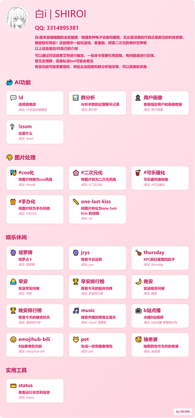

# QQ Bot Help Menu Generator

一个简洁高效的QQ Bot帮助菜单图片生成工具，支持可视化配置、实时预览和一键导出。

## 效果展示

使用本工具生成的 QQ Bot 帮助菜单示例效果：



*上图展示了一个完整的 QQ Bot 帮助菜单，包含机器人头像、基本信息、多个功能分类和丰富的功能卡片。*

## 快速启动

### 1. 安装依赖
```bash
pip install -r requirements.txt
```

### 2. 运行服务器
```bash
python app.py
```

访问 http://localhost:5000 开始使用

## 功能特性

* **可视化编辑** - 在网页中直观配置菜单内容
* **实时预览** - 边编辑边预览效果
* **智能上传** - 支持上传头像、Logo、背景图和自定义字体
* **配置保存** - YAML格式配置永久保存
* **内置主题** - 内置多种主题，支持一件使用

## 项目结构

```
SHIRO_help_review/
├── app.py                 # Flask后端服务
├── config.yaml            # 配置文件（用户数据）
├── requirements.txt       # Python依赖
├── templates/
│   └── index.html        # 主页面
├── static/
│   ├── script.js         # 前端逻辑
│   └── style.css         # 样式表
├── uploads/              # 上传的图片
├── fonts/                # 自定义字体
└── output/               # 生成的输出文件
```

## 使用指南

### 基本配置流程

1. **基本信息** - 设置机器人名称、QQ号、描述和公告
2. **布局设置** - 调整卡片尺寸和间距
3. **主题配色** - 选择预设主题或自定义颜色
4. **字体设置** - 选择字体和调整字号
5. **菜单内容** - 编辑功能分类和具体功能

### 添加功能

在"菜单内容"标签页：
- 点击"+ 新增功能"添加功能卡片
- 支持设置图标、名称、描述和用法
- 使用上下箭头调整顺序
- 点击"×"删除不需要的功能

### 导出图片

完成配置后，点击"下载图片"按钮，浏览器会自动下载PNG格式的帮助菜单图片。

## 常见问题

**Q: 上传的图片显示不出来？**
A: 确保上传的格式为 PNG/JPG/WEBP，且文件大小不超过50MB。

**Q: 预览和下载不一致？**
A: 已优化为完全一致。清除浏览器缓存后重试。

**Q: 字体显示异常？**
A: 请上传标准 TrueType 字体文件（.ttf 或 .otf）。

**Q: 配置保存失败？**
A: 检查 Flask 服务器是否正常运行，确保 config.yaml 文件可写。

## 技术栈

- **后端**: Flask + Pillow (图片处理)
- **前端**: Vanilla JavaScript (ES6) + HTML5 + CSS3
- **配置**: YAML
- **导出**: html2canvas (浏览器原生渲染捕获)

## 许可证

此项目为个人项目。详见项目根目录的 LICENSE 文件。

